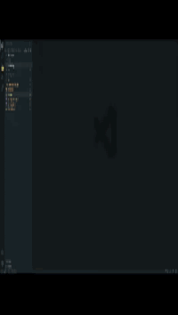
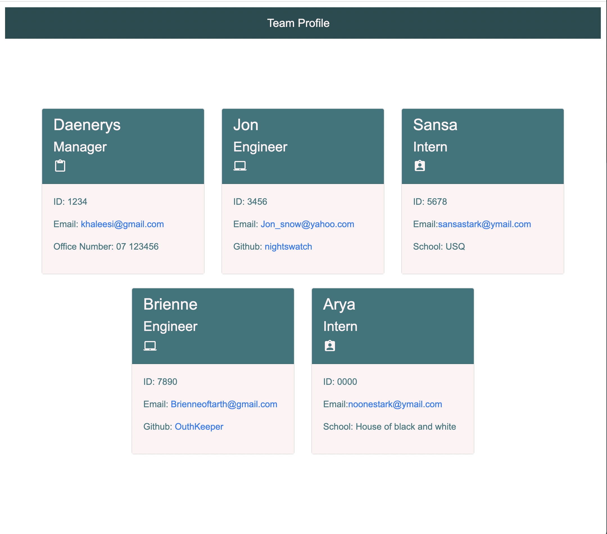

# <Team-profile-gegerator>

# Team profile gegerator
This project is about to create an application called Team profile gegerator 
 whith Node.js command-linethat. This application takes in information about employees on a software engineering team, then generates an HTML webpage that displays summaries for each person. 
 can be used to write and save notes.This application will use an Express.js back end and will save and retrieve note data from a JSON file.
With this application user be able to write and save notes so that they can organize their thoughts and keep track of tasks they need to complete.

## Summery 

```md
This is a command-line application that accepts user input
WHEN I am prompted for my team members and their information
THEN an HTML file is generated that displays a nicely formatted team roster based on user input
WHEN I click on an email address in the HTML
THEN my default email program opens and populates the TO field of the email with the address
WHEN I click on the GitHub username
THEN that GitHub profile opens in a new tab
WHEN I start the application
THEN I am prompted to enter the team manager’s name, employee ID, email address, and office number
WHEN I enter the team manager’s name, employee ID, email address, and office number
THEN I am presented with a menu with the option to add an engineer or an intern or to finish building my team
WHEN I select the engineer option
THEN I am prompted to enter the engineer’s name, ID, email, and GitHub username, and I am taken back to the menu
WHEN I select the intern option
THEN I am prompted to enter the intern’s name, ID, email, and school, and I am taken back to the menu
WHEN I decide to finish building my team
THEN I exit the application, and the HTML is generated
```` 

## Built with

*[Jest](https://www.npmjs.com/package/jest) 

for running the unit tests and 

*[Inquirer](https://www.npmjs.com/package/inquirer)

using the following command:

```bash
node index.js
```

## Link
Because this application won’t be deployed a link provideed to a walkthrough video: 
* [Click here to access and watch demo](https://watch.screencastify.com/v/1gY17gCqlbj2rLs95Y33).

.

The web application's appearance:

